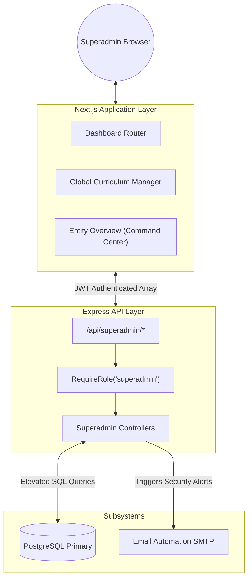

# 1. Superadmin Panel Architecture

The Superadmin architecture represents the "God Mode" tier. Its primary function is high-level orchestration, separated cleanly from company-specific tenant data to avoid permission crossover.

