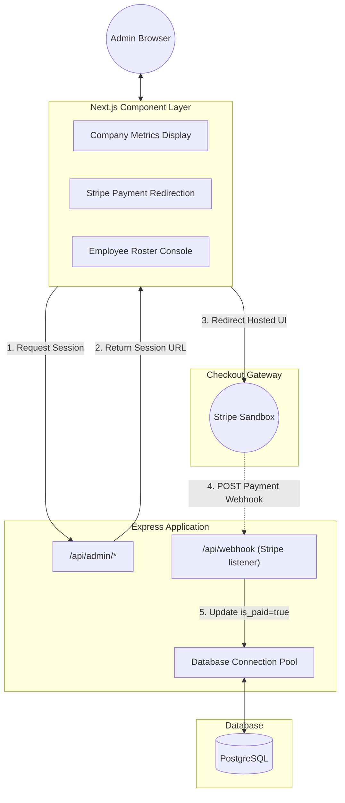

# 2. Admin Panel Architecture

The Admin architecture operates on a tenant-based Isolation scope. The Company Admin acts as the middle orchestrator bridging their employees to the platform.

```mermaid
flowchart TB
    Client((Admin Browser))
    
    subgraph Frontend["Next.js Component Layer"]
        UI_Dash["Company Metrics Display"]
        UI_Billing["Stripe Payment Redirection"]
        UI_Employees["Employee Roster Console"]
    end

    subgraph Gateway["Checkout Gateway"]
        Stripe((Stripe Sandbox))
    end

    subgraph Backend["Express Application"]
        router["/api/admin/*"]
        webhook["/api/webhook (Stripe listener)"]
        db_pool["Database Connection Pool"]
    end

    subgraph DB["Database"]
        PG[(PostgreSQL)]
    end

    Client <--> Frontend
    Frontend --->|1. Request Session| router
    Frontend --->|3. Redirect Hosted UI| Stripe
    router --->|2. Return Session URL| Frontend
    
    Stripe -.->|4. POST Payment Webhook| webhook
    webhook --->|5. Update is_paid=true| db_pool
    db_pool <--> PG
```
