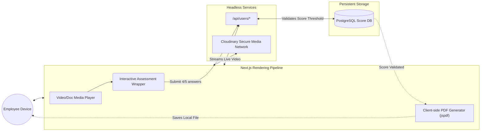

# 3. User Panel Architecture

The Employee (User) architecture focuses heavily on content delivery, media consumption pipelines, and dynamic certification rendering.

```mermaid
flowchart LR
    Client((Employee Device))
    
    subgraph Frontend["Next.js Rendering Pipeline"]
        Player["Video/Doc Media Player"]
        Quiz("Interactive Assessment Wrapper")
        PDF["Client-side PDF Generator (jspdf)"]
    end

    subgraph Backend["Headless Services"]
        API["/api/users/*"]
        Cloudinary["Cloudinary Secure Media Network"]
    end

    subgraph Records["Persistent Storage"]
        DB[(PostgreSQL Score DB)]
    end

    Client <--> Frontend
    Frontend <--> |Loads Module Layouts| API
    Frontend <--> |Streams Live Video| Cloudinary
    
    Player --> Quiz
    Quiz --> |Submit 4/5 answers| API
    API <--> |Validates Score Threshold| DB
    
    DB -.-> |Score Validated| PDF
    PDF -.-> |Saves Local File| Client
```
