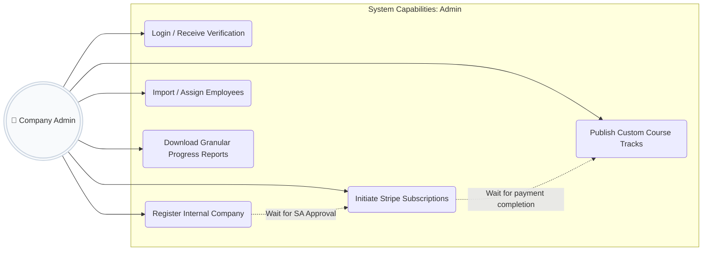

# 4. Admin Panel Use Case Diagram

Detailed capability boundaries for what a Company Admin can structurally execute.

```mermaid
flowchart LR
    classDef actor fill:#f8fafc,stroke:#cbd5e1,stroke-width:2px,shape:circle

    A((("🏢 Company Admin"))):::actor

    subgraph Admin_Access["System Capabilities: Admin"]
        UC1("Login / Receive Verification")
        UC2("Register Internal Company")
        UC3("Initiate Stripe Subscriptions")
        UC4("Publish Custom Course Tracks")
        UC5("Import / Assign Employees")
        UC6("Download Granular Progress Reports")
    end

    A ---> UC1
    A ---> UC2
    A ---> UC3
    A ---> UC4
    A ---> UC5
    A ---> UC6

    UC3 -.-> |Wait for payment completion| UC4
    UC2 -.-> |Wait for SA Approval| UC3
```
