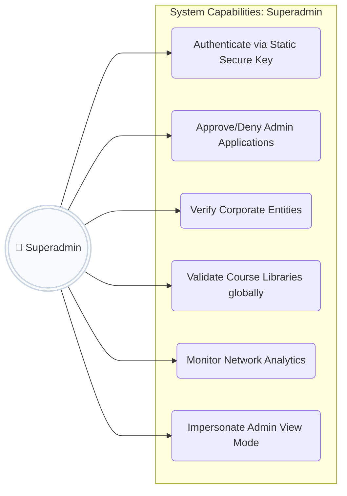

# 5. Super Admin Panel Use Case Diagram

Capabilities specifically reserved for ultimate platform operators.

```mermaid
flowchart LR
    classDef actor fill:#f8fafc,stroke:#cbd5e1,stroke-width:2px,shape:circle

    SA((("👑 Superadmin"))):::actor

    subgraph SA_Access["System Capabilities: Superadmin"]
        UC1("Authenticate via Static Secure Key")
        UC2("Approve/Deny Admin Applications")
        UC3("Verify Corporate Entities")
        UC4("Validate Course Libraries globally")
        UC5("Monitor Network Analytics")
        UC6("Impersonate Admin View Mode")
    end

    SA ---> UC1
    SA ---> UC2
    SA ---> UC3
    SA ---> UC4
    SA ---> UC5
    SA ---> UC6
```
