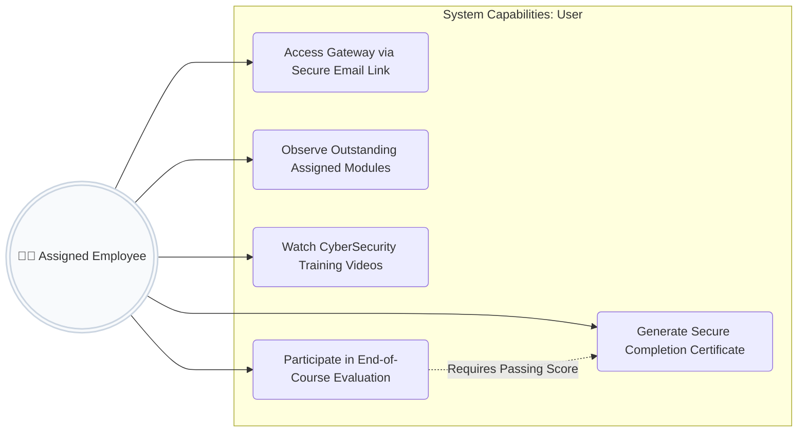

# 6. User Panel Use Case Diagram

Simplistic end-consumer interaction diagram inside the learning portal.

```mermaid
flowchart LR
    classDef actor fill:#f8fafc,stroke:#cbd5e1,stroke-width:2px,shape:circle

    U((("🧑‍💻 Assigned Employee"))):::actor

    subgraph User_Access["System Capabilities: User"]
        UC1("Access Gateway via Secure Email Link")
        UC2("Observe Outstanding Assigned Modules")
        UC3("Watch CyberSecurity Training Videos")
        UC4("Participate in End-of-Course Evaluation")
        UC5("Generate Secure Completion Certificate")
    end

    U ---> UC1
    U ---> UC2
    U ---> UC3
    U ---> UC4
    U ---> UC5

    UC4 -.-> |"Requires Passing Score"| UC5
```
