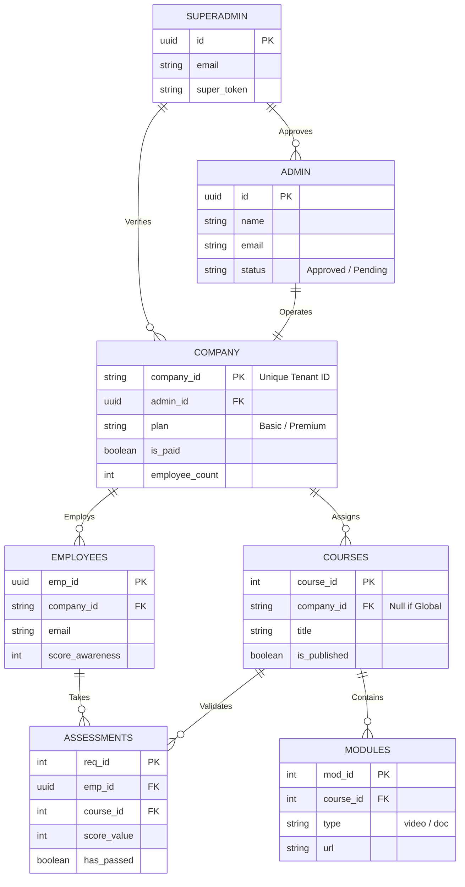

# 8. CyberShield Entity Relationship (ER) Diagram

Represents the data boundaries separating global entities from tenant-specific objects.

```mermaid
erDiagram
    SUPERADMIN {
        uuid id PK
        string email
        string super_token
    }

    ADMIN {
        uuid id PK
        string name
        string email
        string status "Approved / Pending"
    }

    COMPANY {
        string company_id PK "Unique Tenant ID"
        uuid admin_id FK
        string plan "Basic / Premium"
        boolean is_paid
        int employee_count
    }

    EMPLOYEES {
        uuid emp_id PK
        string company_id FK
        string email
        int score_awareness
    }

    COURSES {
        int course_id PK
        string company_id FK "Null if Global"
        string title
        boolean is_published
    }

    MODULES {
        int mod_id PK
        int course_id FK
        string type "video / doc"
        string url
    }

    ASSESSMENTS {
        int req_id PK
        uuid emp_id FK
        int course_id FK
        int score_value
        boolean has_passed
    }

    %% Relationships
    SUPERADMIN ||--o{ ADMIN : "Approves"
    SUPERADMIN ||--o{ COMPANY : "Verifies"
    ADMIN ||--|| COMPANY : "Operates"
    COMPANY ||--o{ EMPLOYEES : "Employs"
    COMPANY ||--o{ COURSES : "Assigns"
    COURSES ||--o{ MODULES : "Contains"
    EMPLOYEES ||--o{ ASSESSMENTS : "Takes"
    COURSES ||--o{ ASSESSMENTS : "Validates"

```
