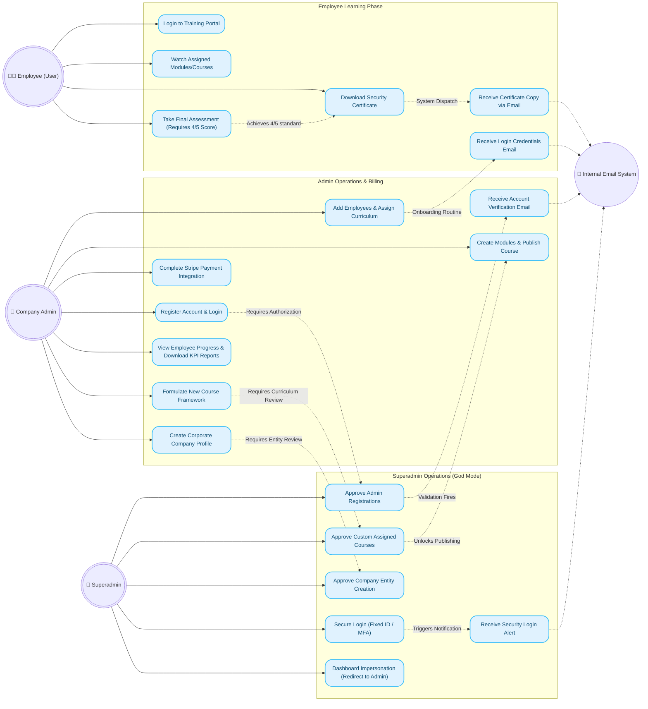

# CyberShield Guard Exhaustive Use Case Flow

This expanded diagram models the highly detailed interaction loops, email communication triggers, and sequential approval processes mapped between Employees, Company Admins, and Superadmins.

